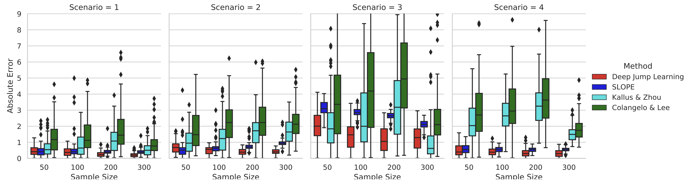

# Deep Jump Learning for Off-Policy Evaluation in Continuous Treatment Settings

This repository is the official implementation of [Deep Jump Learning for Off-Policy Evaluation in Continuous Treatment Settings](https://arxiv.org/pdf/2010.15963.pdf) (NeurIPS, 2021) in Python.

## Introduction

We consider off-policy evaluation (OPE) in continuous treatment settings, such as personalized dose-finding. In OPE, one aims to estimate the mean outcome under a new treatment decision rule using historical data generated by a different decision rule. Most existing works on OPE focus on discrete treatment settings. To handle continuous treatments, we develop a novel estimation method for OPE using deep jump learning (DJL). The key ingredient of our method lies in adaptively discretizing the treatment space using deep discretization, by leveraging deep learning and multi-scale change point detection. This allows us to apply existing OPE methods in discrete treatments to handle continuous treatments. Our method is further justified by theoretical results, simulations, and a real application to Warfarin Dosing.



**Figure 1**: The box plot of the absolute error of estimated values via the proposed DJL method and three kernel-based methods for Scenario 1-4. The target values are 1.33, 1, 4.86 and 1.6, respectively.

## Requirements

 - Python 3.7
 - `numpy`
 - `pandas`
 - `sklearn`
 - `argparse`
 - `pickle`
 - `os`
 - `random`
 - `time` 
 - `datetime` 
 - `multiprocessing`
 - `warnings`
 - `tqdm`
 - `functools`

## Contents

  1. `README.txt`: implementation details of source code and contents

  2. `Supplementary Article.pdf`: technical proofs and additional simulation studies

  3. `Source Code and Simulated Datasets`: Source code of DJL and data generation environment

     a). `DJL.py`: main function for algorithm Deep Jump Learning (DJL).

     b). `Experiments.py`: main code for experiments, including simulation studies and real data analysis.
     
     c). `data_generator.py`: data generation environment, including simulation studies and real data analysis.

     d). `real_envir.pickle`: Note that the real Warfarin Dosing dataset cannot be shared due to privacy protocol. This is a calibrated environment for reproducing the real data.
 

## Training (Simulation Studies)

To reproduce the main experimental results in the simulation studies, run this command:

```train
python Experiments.py --envir_type=<CHOICE1> --sample_size=<CHOICE2> --rep_number=<CHOICE3>
```
CHOICE1 = 'simu1', 'simu2', 'simu3', 'simu4', corresponding to four scenarios in Section 5.1, respectively;
CHOICE2 = 50, 100, 200, 300, corresponding to four choices of the sample size;
CHOICE3 = 100, which is the default number of replications.

(Check more configurations in Section 5.1 and `Experiments.py`)
 
Example: 

```For Scenario 1 with sample size as 50 and replication number as 100:
python Experiments.py --envir_type='simu1' --sample_size=50 --rep_number=100
```

## Evaluation (Real Data of Warfarin Dosing)

To evaluate the proposed DJL on the Real Data of Warfarin Dosing with 20 replication, run: 

```eval
python Experiments.py --envir_type='real' --real_data_file='real_envir.pickle' --sample_size=500 --rep_number=20
```

See more details of the calibrated real dataset in Section 5.2 of our main text.  


## Source Codes for Kernel-Based Methods

We provide the implementation details for kernel-based methods in Section 5.1 of our main text. Their source codes can be found in the following repositories.


* Kallus & Zhou 2018: https://github.com/CausalML/continuous-policy-learning

* SLOPE by Su, Srinath & Krishnamurthy 2020: https://github.com/VowpalWabbit/slope-experiments

 

